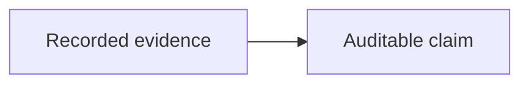

# Generic detailed reasoning

## Knowledge Nodes

#### MixedCase_Claim

The claim uses inline math $P(H \mid E)$ and a
[safe relative note](reference-note.md) plus a
[safe web reference](https://example.org/reference).

$$
P(H \mid E) = \frac{P(E \mid H)P(H)}{P(E)}
$$

## Knowledge Graph

[unsafe link](javascript:globalThis.sourceLinkRan=true)

## Enriched notes

#### MixedCase_Claim

This later same-named heading must not replace Gaia's explicit node anchor.
